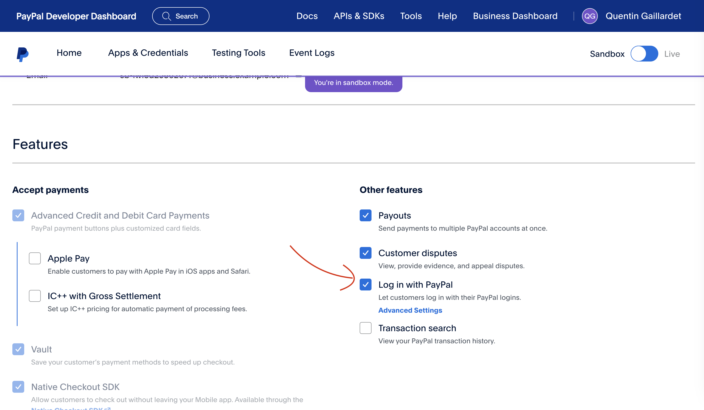

# Eventify

## Description
Application for creating and managing events.


## Installation
1. Clone the repository

HTTPS:
```bash
git clone https://forge.univ-lyon1.fr/ptut2-iem-2023/eventify.git
```

SSH:
```bash
git clone git@forge.univ-lyon1.fr:ptut2-iem-2023/eventify.git
```
2. Add paypal.properties file in root directory
```bash
CLIENT_ID="YOUR CLIENT_ID"
```
> You can find your client id on [Paypal developer](https://developer.paypal.com/developer/applications/). Don't forget to accept login in paypal developer dashboard


3. Add google-services.json file in app directory. 

## Firebase configuration
1. Create a new project on [Firebase](https://console.firebase.google.com/)
2. Add an Android application
3. Add the SHA-1 fingerprint of your application
4. Download the google-services.json file and add it to the app directory
5. Add the following rules to the Firestore database
```bash
rules_version = '2';
service cloud.firestore {
  match /databases/{database}/documents {

    match /User/{userId} {
      allow create: if request.auth != null;
      allow read, write: if request.auth.uid == userId;
    }

    match /Transactions/{eventId}/Transactions/{transactionId} {
      allow create, write: if request.auth != null;
      allow read : if request.auth != null;
    }


    match /Events/{document=**} {
      allow create, write: if request.auth != null;
      allow read;
    }

    match /{document=**} {
      allow read, write: if false;
    }
  }
}
```
6. Add the following rules to the Storage
```bash
rules_version = '2';
service firebase.storage {
  match /b/{bucket}/o {
    // Allow read and write access to files in the "Events/{user.id}" folder
    match /Events/{userId}/{allPaths=**} {
      allow read, write: if request.auth != null && request.auth.uid == userId;
    }
    match /Users/{userId}/{allPaths=**} {
      allow read, write: if request.auth != null && request.auth.uid == userId;
    }
    
    
    // Deny all other read and write access
    match /{allPaths=**} {
      allow read, write: if false;
    }
  }
}
```

